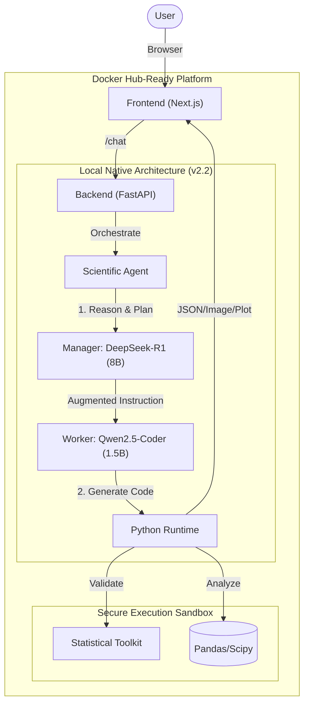

# 🧙‍♂️ Wizard w1

> **Advanced AI Data Analyst Platform** powered by **Qwen2.5-Coder** and **Agentic Workflows**.

           

## 🌟 Overview

**Wizard w1** is an autonomous data science agent capable of performing complex analysis, statistical testing, and visualization from natural language instructions. It features a modern, glassmorphic UI and a robust scalable backend.

Unlike standard chatbots, it operates as a **Senior Data Scientist**:
*   **Plans** its approach before coding.
*   **Validates** assumptions (normality, outliers) automatically.
*   **Refines** its strategies based on execution feedback.

---

## 🔄 Evolution (Legacy vs v2.2.0)

| Feature | v1.0 (Legacy) | v2.2 (Local-Native) |
|---------|---------------|-----------------------|
| **Brain Link** | Required **Ollama** App Service | **Direct Integration** via Transformers |
| **Model Size** | Standard FP16 (Heavy) | **4-Bit Quantization** (Laptop-Ready) |
| **Logic** | Cloud/API Dependency Risk | **100% Offline** (Air-Gapped) |
| **Setup** | Manual Model Pulling | Single-command `download_models.py` |
| **Hardware** | High GPU/RAM Requirement | Supports **CPU Offloading**, **Ollama Turbo**, & Low VRAM |
| **OS Support** | Linux/Mac Preferred | **Windows Native Support** (with Auto-Fallback) |

> [!NOTE]
> **Next Release (v2.3.0)**: Integration of our custom **Wizard-Analyst-Instruct-500k** fine-tuned weights (Worker) currently in training.

---

The system features a **modern, glassmorphic UI** (Next.js 16) backed by a **robust, scalable backend** (FastAPI) and is fully containerized for production.

---

## 🚀 Key Features

*   **🤖 Autonomous Agent**: Understands messy data and executes multi-step Python code (Pandas, Scikit-learn, Statsmodels).
*   **📚 [Wizard-Analyst-Instruct-500k](https://www.kaggle.com/datasets/aniketa14/wizard-analyst-instruct-500k)**: Trained on a massive custom dataset of **500,000 instruction-code pairs** across 6 domains (Dataset Generator excluded from repo to protect IP; data available on Kaggle).
*   **🧠 Intelligent Memory**: Uses a RAG-lite "Knowledge Base" for dynamic few-shot prompting.
*   **⚡ High-Performance UI**:
    *   **Next.js 16 (Turbopack)** & **TailwindCSS v4**.
    *   **Glassmorphism Design** with `framer-motion` animations.
    *   **Optimized Rendering**: React Server Components and `next/image`.
*   **🛡️ Secure Execution**: AST-based code validation and "Silent Execution" mode in a secure sandbox.
*   **🧠 Advanced Cognition**:
    *   **Planning & Critique Loop**: Formulates a statistical plan before execution.
    *   **Thinking UI**: Visualizes the agent's thought process (e.g., `<thought>Analysis...</thought>`) in real-time.
    *   **Planning vs Fast Mode**: Toggle between deep reasoning (Slow/Accurate) and rapid execution (Fast/Reactive).
    *   **Automated Sanity Checks**: Automatically detects Normality (Shapiro-Wilk) and Outliers (IQR).
    *   **Self-Correction**: Analyzes tracebacks to fix code errors autonomously.

---

## 🛠️ Technology Stack

| Layer | Technologies |
|-------|--------------|
| **Frontend** | **Next.js 16**, React 19, TailwindCSS, Framer Motion, Recharts, Lucide |
| **Backend** | **FastAPI** (Async), Pydantic, Uvicorn, LangChain, Structlog |
| **Data Science** | Pandas, NumPy, Scikit-learn, Statsmodels, SciPy, Plotly |
| **Infrastructure** | **Docker**, Docker Compose, GitHub Actions (CI) |
| **Model** | Qwen2.5-Coder-1.5B (Fine-tuned via LoRA) |
| **Data Engine** | Custom Dynamic Schema Engine (Stream-based generation) |

> [!IMPORTANT]
> **Model Training Status (January 2026)**:
> *   **Manager Brain**: Done! Pulled from `deepseek-ai/DeepSeek-R1-Distill-Llama-8B`.
> *   **Worker Brain (Fine-tuned)**: **[IN PROGRESS]**. We are currently training on the **500k Analyst Dataset**. Due to the massive scale, training is estimated to take significant time. 
> *   **Current Action**: The `download_models.py` script currently pulls the high-performance **Qwen2.5-Coder Base** to ensure the agent is functional *today*. The custom "Wizard-Analyst" weights will be pushed to Hugging Face as a v2.3 update once the GPU cluster finishes the run.

---

## ⚙️ Configuration

The application is configured via **Environment Variables**. Create a `.env` file in the `backend/` directory:

| Variable | Default | Description |
|----------|---------|-------------|
| `APP_NAME` | `Wizard AI Agent` | Name of the application. |
| `ENV` | `dev` | Environment (`dev`, `prod`, `test`). |
| `MODEL_TYPE` | `hybrid` | `local` (Native), `ollama` (Turbo Speed), or `hybrid` (Best of Both). |
| `MODEL_NAME` | `deepseek-r1` | Name of the Ollama model to use. |
| `MODEL_PATH` | `./models/worker` | Path to local weights (Your Fine-Tuned Brain). |
| `MANAGER_MODEL_PATH` | `./models/manager` | Path to local native weights (Manager). |
| `OFFLOAD_FOLDER` | `offload` | Directory for GPU memory disk offloading. |
| `MAX_TOKENS` | `2000` | Max generation length for the LLM. |
| `TEMPERATURE` | `0.7` | Creativity of the model (0.0 - 1.0). |

---

## 🏗️ Architecture



---

## 🗺️ Strategic Roadmap (Phases 1-6)

**Wizard w1** was built via a 6-phase evolution to reach enterprise-grade maturity:

1.  **Semantic Data Layer**: Added `CatalogEngine` for PII and financial detection.
2.  **Hardened Sandbox**: Implemented Docker-isolated execution with **Warm Container Pooling**.
3.  **AgentOps & Reliability**: Integrated `Evaluator` scoring and `GuardrailAgent` security scanning.
4.  **Specialist Council**: Developed a committee of agents (Visualizer, Statistician, Architect) to adjudicate results.
5.  **Multi-Session Intelligence**: Persistent **WorkingMemory** (RAG) for cross-session context.
6.  **Enterprise Hardening**: Abstract memory layers, Hardware-Aware Profiles, and Standardized Telemetry.

---

## ⚡ Getting Started

### Method 1: Docker (Recommended - Fast & Local)

You no longer need Ollama or manual training to get started. You can pull the "Base Brains" directly from Hugging Face.

```bash
# 1. Clone the repository
git clone https://github.com/Aniket-a14/Wizard-w1
cd Wizard-w1

# 2. Download the Models (The Wizard's Brains)
# This pulls DeepSeek-R1 (Manager) and Qwen2.5-Coder (Worker)
# Once you fine-tune your own, this script will still populate these slots.
cd backend
pip install -r requirements.txt
python download_models.py 
cd ..

# 3. Start Services
docker-compose up --build
```
*   **Frontend**: `http://localhost:3000`
*   **Backend**: `http://localhost:8000`

---

## 🖥️ Windows Support & Troubleshooting

> [!TIP]
> **Ollama Turbo Mode**: If the local model is too slow (CPU offloading), verify you have [Ollama](https://ollama.com) installed and run `ollama pull deepseek-r1`. Then set `MODEL_TYPE=ollama` in `.env` for **10x speed**.

*   **BitsAndBytes Fallback**: On Windows, 4-bit quantization often fails. We have added an **auto-fallback** mechanism that switches to standard 16-bit caching if this happens.
*   **Session Persistence**: Chat history is stored in `sessionStorage`. It persists on refresh but clears when you close the tab to prevent "412 Precondition" desync errors.

---

### 📦 Distribution & Portability

Wizard w1 is built for high-performance distribution. The ecosystem is split into three layers:

1.  **Code (GitHub)**: Contains the orchestration logic, UI, and workflows.
2.  **Brains (Hugging Face)**: Stores the heavy model weights (5GB - 16GB). Download them via `backend/download_models.py`.
3.  **Containers (Docker)**: Provides a consistent environment. Large weights are mounted via **Volumes** to keep image sizes manageable.

---

### Method 2: Manual Development (Legacy / Low Spec)

**1. Backend Setup**
```bash
cd backend
python -m venv .venv
source .venv/bin/activate  # Windows: .venv\Scripts\Activate.ps1
pip install -r requirements.txt

# Start API
uvicorn src.api.api:app --reload
```

**2. Frontend Setup**
```bash
cd frontend
npm install
npm run dev
```

---

## 🔌 API Reference

The backend exposes a RESTful API. Full Swagger documentation available at `/docs`.

### `POST /upload`
Uploads a dataset for analysis.
*   **Input**: `file` (Multipart/Form-Data, .csv)
*   **Output**: JSON summary (Shape, Columns, Statistical Description).

### `POST /chat`
Interacts with the Scientific Agent.
*   **Input**: `{"message": "Show the distribution of age"}`
*   **Output**: 
    ```json
    {
      "response": "Here is the distribution...",
      "code": "import matplotlib.pyplot as plt...",
      "image": "base64_encoded_string..."
    }
    ```

---

## 🧪 "Skills" & Best Practices Incorporated

This project demonstrates progressive engineering practices across three disciplines:

### 1. Senior Data Scientist
*   **Methodology**: Implemented rigorous workflows for EDA and Model Training (see `.agent/workflows/`).
*   **Statistical Rigor**: Integrated `statsmodels` (ARIMA), `scipy` (T-tests), and automated distribution checks.
*   **Fine-Tuning**: Used LoRA (Low-Rank Adaptation) for efficient model training on the custom 500k dataset.
*   **Dataset**: **Wizard-Analyst-Instruct-500k**, a synthetic dataset covering 6 domains (Retail, Finance, Healthcare, etc.) created with a Dynamic Schema Engine.

### 2. Senior Backend Engineer
*   **Clean Architecture**: Modular design (`src/core`, `src/api`, `src/tools`) separating concerns.
*   **Reliability**: Global Exception Handling, Input Validation (`pandera`), and Structured Logging (`structlog`).
*   **Deployment**: Production-grade `Dockerfile` with multi-stage builds and health checks.

### 3. Senior Frontend Engineer
*   **Modern UX**: "Scientific Wizard" aesthetic using deep dark modes and neon accents.
*   **Performance**: Server Components, Image Optimization, and Lazy Loading.
*   **Code Quality**: TypeScript for type safety and ESLint for strict linting.
*   **SEO & Metadata**: Proper Open Graph tags and layout optimization.

---

## 📂 Project Structure

```bash
Wizard-w1/
├── .agent/                 # Agent Skills & Workflows
│   ├── skills/             # Instructions for senior roles
│   └── workflows/          # EDA & Model Training SOPs
├── .github/workflows/      # CI/CD Pipelines (CI, Release)
├── backend/                # Python FastAPI Service
│   ├── src/
│   │   ├── api/            # API Routers & Middleware
│   │   ├── core/           # Agent Logic (Planning, Execution)
│   │   │   └── tools/      # Statistical Toolkit (Pandas/Scipy)
│   │   ├── utils/          # Logging, Cache, Validation
│   │   └── config.py       # Configuration Settings
│   ├── dataset/            # 500k Instruction Dataset (Ignored)
│   ├── models/             # Local Brains (Ignored)
│   ├── tests/              # Pytest Suite (Unit + E2E)
│   ├── Dockerfile
│   └── requirements.txt
├── frontend/               # Next.js 16 Application
│   ├── app/                # App Router (Dashboard, Landing)
│   ├── components/         # Reusable UI (Chat, Visualizer)
│   ├── public/             # Static Assets
│   ├── Dockerfile
│   └── README.md           # 🎨 Dedicated Frontend Documentation
├── docker-compose.yml      # Orchestration Config
└── README.md
```

## 📜 License
Released under the BSD 3-Clause License. Redistribution and use are permitted under the terms described in the [LICENSE](./LICENSE) file.
