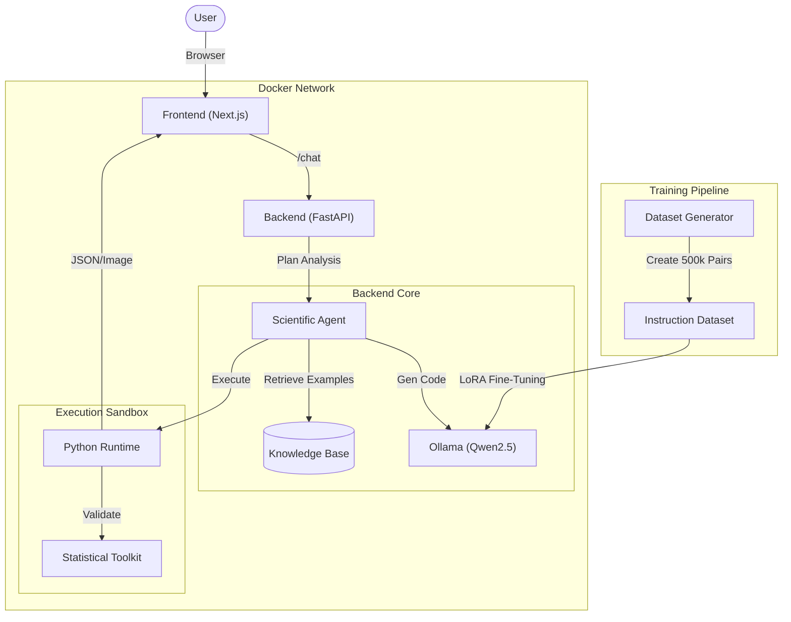

# 🧙‍♂️ Wizard w1

> **Advanced AI Data Analyst Platform** powered by **Qwen2.5-Coder** and **Agentic Workflows**.

   

## 🌟 Overview

**Wizard w1** is an autonomous data science agent capable of performing complex analysis, statistical testing, and visualization from natural language instructions. It features a modern, glassmorphic UI and a robust scalable backend.

Unlike standard chatbots, it operates as a **Senior Data Scientist**:
*   **Plans** its approach before coding.
*   **Validates** assumptions (normality, outliers) automatically.
*   **Refines** its strategies based on execution feedback.

The system features a **modern, glassmorphic UI** (Next.js 16) backed by a **robust, scalable backend** (FastAPI) and is fully containerized for production.

---

## 🚀 Key Features

*   **🤖 Autonomous Agent**: Understands messy data and executes multi-step Python code (Pandas, Scikit-learn, Statsmodels).
*   **📚 Wizard-Analyst-Instruct-500k**: Trained on a massive custom dataset of **500,000 instruction-code pairs** across 6 domains.
*   **🧠 Intelligent Memory**: Uses a RAG-lite "Knowledge Base" for dynamic few-shot prompting.
*   **⚡ High-Performance UI**:
    *   **Next.js 16 (Turbopack)** & **TailwindCSS v4**.
    *   **Glassmorphism Design** with `framer-motion` animations.
    *   **Optimized Rendering**: React Server Components and `next/image`.
*   **🛡️ Secure Execution**: AST-based code validation and "Silent Execution" mode in a secure sandbox.
*   **🧠 Advanced Cognition**:
    *   **Planning & Critique Loop**: Formulates a statistical plan before execution.
    *   **Automated Sanity Checks**: Automatically detects Normality (Shapiro-Wilk) and Outliers (IQR).
    *   **Self-Correction**: Analyzes tracebacks to fix code errors autonomously.

---

## 🛠️ Technology Stack

| Layer | Technologies |
|-------|--------------|
| **Frontend** | **Next.js 16**, React 19, TailwindCSS, Framer Motion, Recharts, Lucide |
| **Backend** | **FastAPI** (Async), Pydantic, Uvicorn, LangChain, Structlog |
| **Data Science** | Pandas, NumPy, Scikit-learn, Statsmodels, SciPy, Plotly |
| **Infrastructure** | **Docker**, Docker Compose, GitHub Actions (CI) |
| **Model** | Qwen2.5-Coder-1.5B (Fine-tuned via LoRA) |
| **Data Engine** | Custom Dynamic Schema Engine (Stream-based generation) |

---

## ⚙️ Configuration

The application is configured via **Environment Variables**. Create a `.env` file in the `backend/` directory:

| Variable | Default | Description |
|----------|---------|-------------|
| `APP_NAME` | `Wizard AI Agent` | Name of the application. |
| `ENV` | `dev` | Environment (`dev`, `prod`, `test`). |
| `MODEL_TYPE` | `hybrid` | `ollama` (Local LLM), `local` (HuggingFace), or `hybrid`. |
| `MODEL_NAME` | `deepseek-r1` | Name of the Ollama model to use. |
| `MODEL_PATH` | `./fine_tuned_model` | Path to local fine-tuned weights. |
| `MAX_TOKENS` | `2000` | Max generation length for the LLM. |
| `TEMPERATURE` | `0.7` | Creativity of the model (0.0 - 1.0). |

---

## 🏗️ Architecture



---

## ⚡ Getting Started

### Method 1: Docker (Recommended)

> **⚠️ Prerequisite**: You must **train the model** before starting the Docker container to ensure valid model artifacts are available.

```bash
# 1. Clone the repository
git clone https://github.com/Aniket-a14/Wizard-w1
cd Wizard-w1

# 2. Train the Model (Required)
cd backend
python train.py 
cd ..

# 3. Start Services
docker-compose up --build
```
*   **Frontend**: `http://localhost:3000`
*   **Backend**: `http://localhost:8000/docs`

### Method 2: Manual Development

**1. Backend Setup**
```bash
cd backend
python -m venv .venv
source .venv/bin/activate  # Windows: .venv\Scripts\Activate.ps1
pip install -r requirements.txt

# Start API
uvicorn src.api.api:app --reload
```

**2. Frontend Setup**
```bash
cd frontend
npm install
npm run dev
```

---

## 🔌 API Reference

The backend exposes a RESTful API. Full Swagger documentation available at `/docs`.

### `POST /upload`
Uploads a dataset for analysis.
*   **Input**: `file` (Multipart/Form-Data, .csv)
*   **Output**: JSON summary (Shape, Columns, Statistical Description).

### `POST /chat`
Interacts with the Scientific Agent.
*   **Input**: `{"message": "Show the distribution of age"}`
*   **Output**: 
    ```json
    {
      "response": "Here is the distribution...",
      "code": "import matplotlib.pyplot as plt...",
      "image": "base64_encoded_string..."
    }
    ```

---

## 🧪 "Skills" & Best Practices Incorporated

This project demonstrates **Level 100** engineering practices across three disciplines:

### 1. Senior Data Scientist
*   **Methodology**: Implemented rigorous workflows for EDA and Model Training (see `.agent/workflows/`).
*   **Statistical Rigor**: Integrated `statsmodels` (ARIMA), `scipy` (T-tests), and automated distribution checks.
*   **Fine-Tuning**: Used LoRA (Low-Rank Adaptation) for efficient model training on the custom 500k dataset.
*   **Dataset**: **Wizard-Analyst-Instruct-500k**, a synthetic dataset covering 6 domains (Retail, Finance, Healthcare, etc.) created with a Dynamic Schema Engine.

### 2. Senior Backend Engineer
*   **Clean Architecture**: Modular design (`src/core`, `src/api`, `src/tools`) separating concerns.
*   **Reliability**: Global Exception Handling, Input Validation (`pandera`), and Structured Logging (`structlog`).
*   **Deployment**: Production-grade `Dockerfile` with multi-stage builds and health checks.

### 3. Senior Frontend Engineer
*   **Modern UX**: "Scientific Wizard" aesthetic using deep dark modes and neon accents.
*   **Performance**: Server Components, Image Optimization, and Lazy Loading.
*   **Code Quality**: TypeScript for type safety and ESLint for strict linting.
*   **SEO & Metadata**: Proper Open Graph tags and layout optimization.

---

## 📂 Project Structure

```bash
Wizard-w1/
├── .agent/                 # Agent Skills & Workflows
│   ├── skills/             # Instructions for senior roles
│   └── workflows/          # EDA & Model Training SOPs
├── .github/workflows/      # CI/CD Pipelines (CI, Release)
├── backend/                # Python FastAPI Service
│   ├── src/
│   │   ├── api/            # API Routers & Middleware
│   │   ├── core/           # Agent Logic (Planning, Execution)
│   │   │   └── tools/      # Statistical Toolkit (Pandas/Scipy)
│   │   ├── utils/          # Logging, Cache, Validation
│   │   └── config.py       # Configuration Settings
│   ├── dataset/            # 500k Instruction Dataset
│   ├── tests/              # Pytest Suite (Unit + E2E)
│   ├── Dockerfile
│   └── requirements.txt
├── frontend/               # Next.js 16 Application
│   ├── app/                # App Router (Dashboard, Landing)
│   ├── components/         # Reusable UI (Chat, Visualizer)
│   ├── public/             # Static Assets
│   └── Dockerfile
├── docker-compose.yml      # Orchestration Config
└── README.md
```

## 📜 License
MIT
