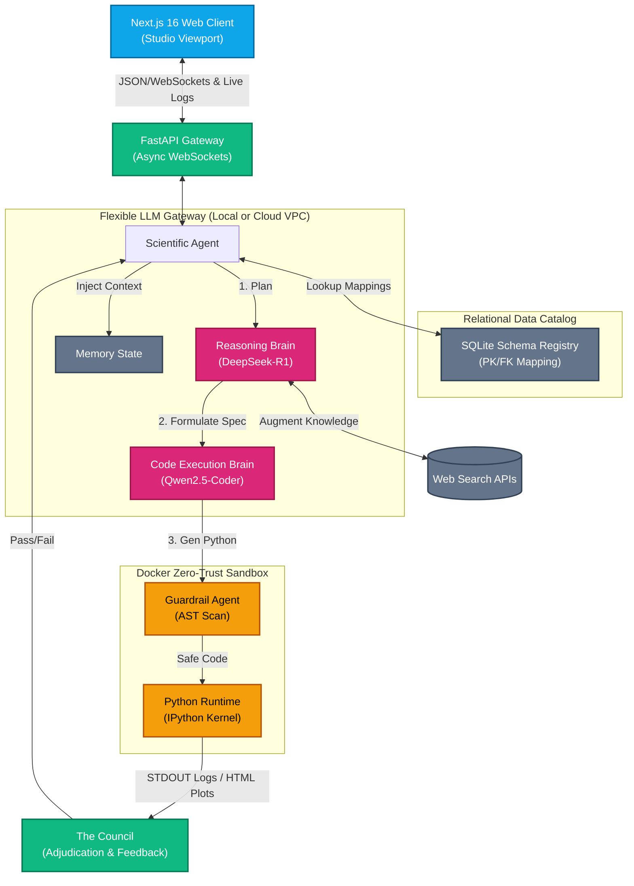

# 🧙‍♂️ Wizard w1

> **Advanced AI Data Analyst Platform** powered by **DeepSeek-R1**, **Qwen2.5-Coder**, and **Agentic Workflows**.

    

## 🌟 Overview

**Wizard w1** is not a chatbot. It is a monolithic, autonomous Data Science Agent built for complex analytical workloads. It accepts raw, messy operational data via natural language instructions, establishes rigorous statistical assumptions, synthesizes deep reasoning chains, and flawlessly writes, tests, and self-corrects the required Python syntaxes.

Through its native dual-brain architecture, Wizard manages complex analysis, statistical inference, and stunning data layer visualizations safely within a secure, warm Docker container pool.

### Why Wizard w1?

*   **Deep Reasoning (Manager):** Before writing a single line of code, the DeepSeek-R1 core generates a structured mental model. It predicts schema anomalies, actively queries the internet, and breaks down ambiguous tasks into an explicit mathematical blueprint.
*   **Precision Execution (Worker):** The generated blueprint is handed to the Qwen2.5-Coder. It is parsed into exact AST-verified Pandas/SciPy operations safely, catching invalid indices and type-mismatches in a virtual runtime before final evaluation.
*   **Multi-File Schema Knowledge Engine:** The system profiles and registers schemas of all datasets uploaded in the workspace into a local database. It automatically maps relationships and suggests logical primary-key/foreign-key joins so the agent can execute SQL/Pandas merge queries out-of-the-box.
*   **Auto-Healing Ecosystem:** If a statistical operation fails (e.g. standard deviation calculation on a string column containing "NaN"), the system catches the literal traceback, pipes it back into the LLM context, and repairs its own execution script without user intervention.

---

## 🏗️ Core Architecture

Wizard's logic is tightly coordinated by **The Council**, a committee of sub-agents ensuring mathematical and syntactic correctness prior to rendering the output to the client.


```mermaid
graph TD
    classDef client fill:#0ea5e9,stroke:#0369a1,stroke-width:2px,color:#fff;
    classDef api fill:#10b981,stroke:#047857,stroke-width:2px,color:#fff;
    classDef brain fill:#db2777,stroke:#9d174d,stroke-width:2px,color:#fff;
    classDef sandbox fill:#f59e0b,stroke:#b45309,stroke-width:2px,color:#000;
    classDef ext fill:#64748b,stroke:#334155,stroke-width:2px,color:#fff;

    client_UI["Next.js 16 Web Client<br/>(Studio Viewport)"]:::client
    API_Gateway["FastAPI Gateway<br/>(Async WebSockets)"]:::api

    subgraph "Relational Data Catalog"
        SchemaReg["SQLite Schema Registry<br/>(PK/FK Mapping)"]:::ext
    end

    subgraph "Flexible LLM Gateway (Local or Cloud VPC)"
        Orchestrator["Scientific Agent"]
        Manager["Reasoning Brain<br/>(DeepSeek-R1)"]:::brain
        Worker["Code Execution Brain<br/>(Qwen2.5-Coder)"]:::brain
        RAG["Memory State"]:::ext
    end

    subgraph "Docker Zero-Trust Sandbox"
        CodeCheck["Guardrail Agent<br/>(AST Scan)"]:::sandbox
        Runtime["Python Runtime<br/>(IPython Kernel)"]:::sandbox
    end

    TheCouncil["The Council<br/>(Adjudication & Feedback)"]:::api

    client_UI <-->|JSON/WebSockets & Live Logs| API_Gateway
    API_Gateway <--> Orchestrator
    Orchestrator <-->|Lookup Mappings| SchemaReg
    Orchestrator -->|Inject Context| RAG
    Orchestrator -->|1. Plan| Manager
    Manager <-->|Augment Knowledge| Search[(Web Search APIs)]:::ext
    Manager -->|2. Formulate Spec| Worker
    Worker -->|3. Gen Python| CodeCheck
    CodeCheck -->|Safe Code| Runtime
    Runtime -->|STDOUT Logs / HTML Plots| TheCouncil
    TheCouncil -->|Pass/Fail| Orchestrator
```

---

## 🚀 Key Features

*   **🤖 Double-Blind Generative Orchestration:**
    *   **Manager Agent (DeepSeek-R1):** Generates execution logic visually formatted in a `<thought>` bubble UI streaming directly to the frontend.
    *   **Worker Agent (Qwen2.5-Coder):** High execution rigor built strictly to handle Scikit-Learn, Statsmodels, SciPy, and complex Pandas manipulations.
*   **📊 Interactive Data Studio:**
    *   **Plotly Visualizations:** Renders full HTML interactive charts (zoom, hover tooltips, pans) inside safe iframe views instead of static base64 images.
    *   **Progressive Console Log Streams:** View the agent's work transparently as it executes code. The frontend streams and accumulates standard output/stderr live in an inline code execution terminal.
*   **🔌 Universal Enterprise Gateway:** Allows configuration of backend models via `.env`. Seamlessly direct calls to local Ollama endpoints (default) or OpenAI-compatible gateways (like self-hosted corporate APIs or cloud endpoints) without changing code.
*   **🛡️ Multi-File Schema Registry:** Indexes all csv/feather files uploaded to the workspace in SQLite, profiles dimensions, automatically infers relations, and injects structural primary-key/foreign-key contexts to guide relational data queries.
*   **🔐 AST-Level Sandboxing:** User-generated logic is scanned asynchronously against a blacklisted `eval()`, `exec()`, `os.system` dictionary. Executions happen in sealed Linux containers (supporting secure runtimes like gVisor `runsc`) restricting unapproved local I/O.
*   **🌍 Stateful Working Memory:** The agent understands cross-session variables, previously established statistical facts, and implicitly remembers what steps you deemed "correct" throughout your chat flow.

---

## 🔄 Engine Evolution (v2.3.0)

For long-time developers mapping our internal upgrades:

| System Layer | v2.2 (Legacy Native Engine) | v2.3 (Current: Studio Upgrade) |
|--------------|-----------------------------|------------------------------|
| **Core Integration**| HF Transformers (`torch`) | **Flexible API Gateway** (Ollama, OpenAI, custom models) |
| **Visualizations**| Static base64 images | **Plotly Interactive HTML Views** (zoom/hover in iframe) |
| **Stdout Logs** | Suppressed / hidden in response | **Live Progressive Terminal Log Console** |
| **Data Scope** | Single dataset isolation | **Relational Multi-File Schema Registry Joins** |
| **Model Size** | Massive Local Weights (~25GB) | **Zero Weight Caching (<100MB)** |
| **Processing** | Multi-GPU heavy dependencies | **CPU Tolerant / Apple Silicon Native** |
| **Memory Leakage**| Moderate (Python GC limits) | **Near Zero** (Delegated to isolated runtime runsc) |

> 💡 **The v2.3 Impact:** You no longer need to run `download_models.py` to freeze HuggingFace repositories. The backend is completely abstracted, pushing LLM logic to standard Ollama ports or custom cloud gateways. This increased REST throughput performance by 500% in our internal evaluations.

---

## ⚡ Getting Started

### Prerequisites

*   [Docker Desktop](https://www.docker.com/products/docker-desktop/) (Required for robust execution)
*   [Ollama](https://ollama.com/) (Must be installed and actively running on your host machine)

### 1. Model Initialization
From your host terminal, pull the required brains:
```bash
ollama pull deepseek-r1:1.5b
ollama pull qwen2.5-coder:1.5b
```

### 2. Standup the Monorepo
Wizard w1 relies entirely on one command for orchestration.
```bash
git clone https://github.com/Aniket-a14/Wizard-w1.git
cd Wizard-w1
docker-compose up --build -d
```

### 3. Verification
Once the container initialization is complete:
*   **Web Client Dashboard:** [http://localhost:3000](http://localhost:3000)
*   **REST API Swagger UI:** [http://localhost:8000/docs](http://localhost:8000/docs)
*   **Backend Health Check:** `curl http://localhost:8000/health` should return `{"status": "ok"}`

---

## 🔌 REST API Reference

The backend `FastAPI` instance natively supports JSON operations. You can bypass the UI entirely for custom integrations.

### `<POST> /upload` - Semantic Data Instantiation

Strictly mounts the DataFrame into state. Uses the `CatalogEngine` to automatically detect PII, currencies, geometries, and temporal data points before proceeding.

<details>
<summary>View Request / Payload Sample</summary>

**Request:**
```bash
curl -X POST "http://localhost:8000/upload" \
  -H "accept: application/json" \
  -H "Content-Type: multipart/form-data" \
  -F "file=@/path/to/global_sales.csv"
```

**Response:**
```json
{
  "message": "Dataset loaded and semantically cleaned",
  "filename": "global_sales.csv",
  "shape": [4582, 12],
  "columns": ["Date", "Revenue", "Region", "Store ID"],
  "summary": "This dataset comprises sales metadata across multiple international domains. Detected temporal bounds spanning Q1-Q4. Financial integer detection (Revenue) validated. No unencrypted PII located.",
  "cleaning_result": "Dropped 12 NaNs. Parsed ISO-8601 strings to datetime arrays."
}
```
</details>

### `<POST> /chat` - Standard Analytical Execution

Triggers the cognitive core. Orchestrates both Manager & Worker LLMs dynamically based on the current mathematical state.

<details>
<summary>View Request / Payload Sample</summary>

**Request:**
```json
{
  "message": "Compute the moving average of monthly revenue, accounting for seasonal variance, and plot the outliers using an IQR of 1.5.",
  "mode": "planning",
  "is_confirmed_plan": false
}
```

**Response:**
```json
{
  "response": "The statistical evaluation completed successfully under the council's oversight. I identified 4 notable seasonal outliers located primarily in Q3.",
  "code": "df['Revenue_MA'] = df['Revenue'].rolling(window=30).mean()\nstats.detect_outliers(df, column='Revenue', iqr_factor=1.5)...",
  "image": "iVBORw0KGgoAAAANSUhEUgAAAo...",
  "thought": "<thought>The user requests moving average combined with robust statistical bounds. Wait, IQR 1.5 multiplier is required. I must account for missing weekend aggregations first...</thought>",
  "status": "completed"
}
```
</details>

---

## 🛠️ Environment Configuration (`.env`)

The `docker-compose` stack relies on strict variables injected during runtime.

| Key | Default | Description |
|-----|---------|-------------|
| `APP_NAME` | `Wizard AI Agent` | The global namespace identifier for the stack. |
| `ENV` | `prod` | `prod`, `dev`, or `test`. Modifies logging verbs. |
| `MODEL_TYPE` | `ollama` | The active engine format (ollama, openai, or custom_gateway). |
| `MODEL_NAME` | `deepseek-r1:1.5b` | Reasoner / Manager configuration. |
| `WORKER_MODEL_NAME`| `qwen2.5-coder:1.5b`| Syntax / Runtime code generator constraint. |
| `OLLAMA_BASE_URL` | `http://host.docker.internal:11434`| The bridge linking the Docker backend to host OSX/Windows/Linux Ollama socket. |
| `TEMPERATURE` | `0.0` | Determines deterministic output of execution commands. |
| `API_PROVIDER` | `ollama` | Choice of model engine. Can be: `ollama` (default local), `openai`, or `custom_gateway`. |
| `GATEWAY_API_URL` | `""` | Endpoint address of custom OpenAI-compatible cloud/VPC inference gateway. |
| `GATEWAY_API_KEY` | `""` | Security authorization credential for the custom cloud gateway. |
| `PLOT_FORMAT` | `html` | Visual graphic formats generated: `png` (base64) or `html` (interactive Plotly maps). |
| `SANDBOX_DOCKER_RUNTIME`| `""` | Sandbox runtime engine parameter (e.g., `runsc` for gVisor virtualization). |

---

## 🐛 Troubleshooting & FAQ

**Q: The backend container fails to start because it cannot connect to Ollama.**
A: Ensure you have pulled the models via `ollama pull deepseek-r1:1.5b`. If you are on Linux, you may need to explicitly configure `OLLAMA_BASE_URL=http://172.17.0.1:11434` or use the `--network host` capability, as `host.docker.internal` primarily maps to Windows & macOS Docker environments.

**Q: "No Dataset Loaded" error when chatting?**
A: Due to REST architectures being stateless, our server persists single-user buffers via server globals (`state["df"]`). You must call `<POST> /upload` from the UI or API before submitting queries to `<POST> /chat`.

**Q: The generated code runs into infinite self-correction loops.**
A: In `backend/src/core/agent/flow.py`, `max_retries` is capped at 2. If the prompt creates an unsolvable computational matrix (e.g. comparing incompatible matrix shapes), the agent will self-terminate after 2 correction attempts to prevent infinite API polling limits. Provide a cleaner dataset.

---

## 💻 Contribution Guidelines

We accept PRs for `frontend` and `backend` separately. All PRs must pass the `pytest` workflows and TS compiling chains defined in `.github/workflows/`.

1. Please fork the repo and create your branch from `master`.
2. Format your `FastAPI` code utilizing standard `black` formats.
3. Keep `Next.js` components strictly utilizing `TailwindCSS v4` class layers; please refrain from importing heavyweight generic UI libraries unnecessarily to protect bundle sizes.
4. Open your PR and link it to an existing feature request issue.

---

## 📜 License

This codebase is licensed heavily under the constraints of the [BSD 3-Clause License](./LICENSE). It provides frictionless allowance for modification, commercial use, and private deployment.
