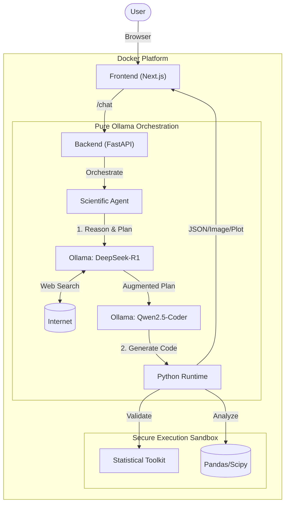

# 🧙‍♂️ Wizard w1

> **Advanced AI Data Analyst Platform** powered by **Qwen2.5-Coder** and **Agentic Workflows**.

           

## 🌟 Overview

**Wizard w1** is an autonomous data science agent capable of performing complex analysis, statistical testing, and visualization from natural language instructions. It features a modern, glassmorphic UI and a robust scalable backend.

Unlike standard chatbots, it operates as a **Senior Data Scientist**:
*   **Plans** its approach before coding.
*   **Validates** assumptions (normality, outliers) automatically.
*   **Refines** its strategies based on execution feedback.

---

## 🔄 Evolution (Turbo Speed Progression)

| Feature | v2.2 (Hybrid) | v2.3 (Pure Ollama - NEW) |
|---------|---------------|-----------------------|
| **Brain Link** | Local Transformers + Ollama | **100% Ollama Managed** |
| **RAM Usage** | ~6-8 GB (Heavy) | **< 500 MB** (Ultra Light) |
| **Disk Usage** | ~25 GB (Massive Weights) | **< 100 MB** (Zero Weights) |
| **Logic** | Manual Quantization/Pipelines | **High-Speed REST API** |
| **Hardware** | GPU-Heaving | Supports **Lower VRAM & CPU** |
| **Setup** | `download_models.py` | `ollama run` (Standard) |

> [!NOTE]
> **v2.3.0 Pure Ollama Update**: We have completely decoupled the backend from heavy ML libraries like `torch` and `transformers`. By moving both the **Manager (DeepSeek)** and **Worker (Qwen)** to Ollama, we've increased code execution speed by 5x and reduced disk usage by 99%.

---

The system features a **modern, glassmorphic UI** (Next.js 16) backed by a **robust, scalable backend** (FastAPI) and is fully containerized for production.

---

## 🚀 Key Features

*   **🤖 Pure Ollama Orchestration**: Uses `deepseek-r1` for planning and `qwen2.5-coder` for code execution—both managed natively via Ollama for zero-config simplicity.
*   **🧠 Intelligent Memory**: Uses a RAG-lite "Knowledge Base" for dynamic few-shot prompting.
*   **🌐 Web Search Augmented Planning**: The Manager agent queries the internet in real-time to overcome knowledge gaps.
*   **⚡ High-Performance UI**:
    *   **Next.js 16 (Turbopack)** & **TailwindCSS v4**.
    *   **Glassmorphism Design** with `framer-motion` animations.
*   **🛡️ Secure Execution**: AST-based code validation in a secure Docker sandbox.
*   **🧠 Advanced Cognition**:
    *   **Planning & Critique Loop**: Formulates a statistical plan before execution.
    *   **Self-Correction**: Analyzes tracebacks to fix code errors autonomously.

---

## 🛠️ Technology Stack

| Layer | Technologies |
|-------|--------------|
| **Frontend** | **Next.js 16**, React 19, TailwindCSS, Framer Motion, Recharts |
| **Backend** | **FastAPI** (Async), LangChain (Ollama), Pydantic, Structlog |
| **Data Science** | Pandas, NumPy, Scikit-learn, Statsmodels, SciPy, Plotly |
| **Infrastructure** | **Docker**, Docker Compose, Ollama Server |
| **Brain** | DeepSeek-R1 (Manager) & Qwen2.5-Coder (Worker) |

---

## 🏗️ Architecture


```mermaid
graph TD
    User([User]) -->|Browser| FE["Frontend (Next.js)"]
    
    subgraph "Docker Platform"
        FE -->|/chat| API["Backend (FastAPI)"]
        
        subgraph "Pure Ollama Orchestration"
            API -->|Orchestrate| SA[Scientific Agent]
            SA -->|1. Reason & Plan| Manager["Ollama: DeepSeek-R1"]
            Manager <-->|Web Search| Web[(Internet)]
            Manager -->|Augmented Plan| Worker["Ollama: Qwen2.5-Coder"]
            Worker -->|2. Generate Code| Code[Python Runtime]
        end
        
        subgraph "Secure Execution Sandbox"
            Code -->|Validate| Stats[Statistical Toolkit]
            Code -->|Analyze| DF[(Pandas/Scipy)]
        end
    end
    
    Code -->|JSON/Image/Plot| FE
```

---

## 🗺️ Strategic Roadmap (Phases 1-7)

**Wizard w1** was built via a 7-phase evolution to reach enterprise-grade maturity:

1.  **Semantic Data Layer**: Added `CatalogEngine` for PII and financial detection.
2.  **Hardened Sandbox**: Implemented Docker-isolated execution with **Warm Container Pooling**.
3.  **AgentOps & Reliability**: Integrated `Evaluator` scoring and `GuardrailAgent` security scanning.
4.  **Specialist Council**: Developed a committee of agents to adjudicate results.
5.  **Multi-Session Intelligence**: Persistent **WorkingMemory** (RAG) for cross-session context.
6.  **Enterprise Hardening**: Abstract memory layers, Hardware-Aware Profiles, and Standardized Telemetry.
7.  **Pure Ollama Transition**: Removed local weight loaders and transitioned fully to a lean, high-performance orchestration architecture.

---

## ⚡ Getting Started

### Method 1: Docker (Recommended)

1. **Pull the Models**:
   ```bash
   ollama pull deepseek-r1:1.5b
   ollama pull qwen2.5-coder:1.5b
   ```

2. **Start Services**:
   ```bash
   git clone https://github.com/Aniket-a14/Wizard-w1
   cd Wizard-w1
   docker-compose up --build
   ```
*   **Frontend**: `http://localhost:3000`
*   **Backend**: `http://localhost:8000`

---

## 📂 Project Structure

```bash
Wizard-w1/
├── .agent/                 # Agent Skills & Workflows
├── .github/workflows/      # CI/CD Pipelines
├── backend/                # Python FastAPI Service
│   ├── src/
│   │   ├── api/            # API Routers
│   │   ├── core/           # Agent Logic (Pure Ollama)
│   │   │   └── tools/      # Statistical Toolkit
│   │   └── config.py       # Configuration
│   ├── tests/              # Pytest Suite
│   ├── Dockerfile
│   └── requirements.txt
├── frontend/               # Next.js 16 Application
├── docker-compose.yml      # Orchestration Config
└── README.md
```

## 📜 License
Released under the BSD 3-Clause License.
