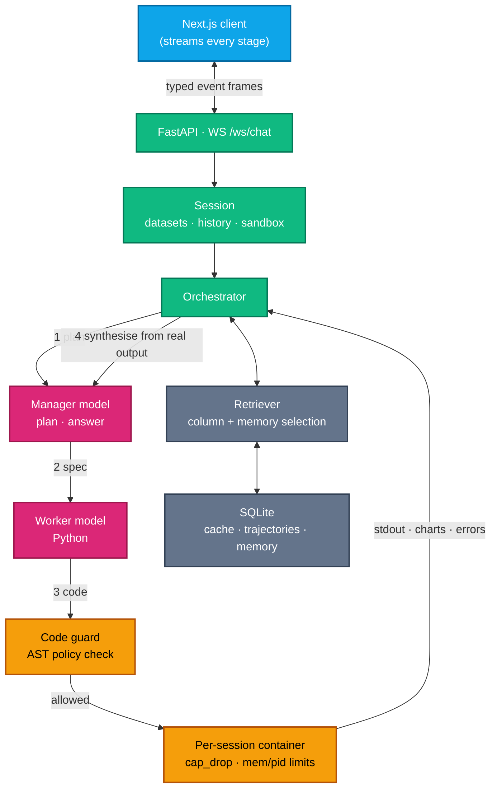

# 🧙‍♂️ Wizard w1

> A local-first autonomous data analysis agent. Ask a question about your data; it plans the analysis, writes Python, runs it in an isolated sandbox, and explains the result — streaming its reasoning as it goes.

    

## What it is

Wizard runs entirely on your machine. Your data never leaves it, and no API key is required.

You upload a file and ask a question in plain language. A **manager** model reasons about the request and produces a plan; a **worker** model turns that plan into Python; the code is statically screened and executed inside a Docker container scoped to your session; the manager then reads the real output and writes the answer. If the code fails, the traceback goes back to the model and it fixes itself.

Every stage streams to the browser as it happens — the reasoning, the plan, the generated code, the program's stdout, and the answer token by token.

## Why you might want it

- **Local first.** Two small Ollama models are enough to be useful. Nothing is sent anywhere.
- **You choose the models.** The UI lists what you have actually pulled and lets you assign a model to each role per session.
- **It runs the code, it doesn't just suggest it.** Results come from execution, not from a model claiming an answer.
- **It corrects itself.** Failures are fed back with the traceback, and successful repairs are remembered as negative examples for next time.
- **It is honest about degradation.** No Docker? It says so and runs in a restricted interpreter. No embedding model? Retrieval falls back to lexical matching. Model unreachable? You get a clear message, not a hang.

## Quick start

**Prerequisites:** [Docker Desktop](https://www.docker.com/products/docker-desktop/) and [Ollama](https://ollama.com/).

```bash
ollama pull deepseek-r1:1.5b     # reasoning
ollama pull qwen2.5-coder:1.5b   # code

git clone https://github.com/Aniket-a14/Wizard-w1.git
cd Wizard-w1
docker compose up --build -d
```

Open **http://localhost:3000**. API docs are at **http://localhost:8000/docs**.

Any model you have pulled will appear in the model picker; the two above are just small defaults that fit on a laptop.

### Using LM Studio instead of (or alongside) Ollama

LM Studio works out of the box — no configuration needed if it is on its default port.

1. In LM Studio, open **Developer** and **Start Server**.
2. Turn on **Serve on Local Network**. LM Studio binds to loopback by default, so the backend container cannot reach it otherwise. (Skip this if you run the backend outside Docker.)
3. In the model picker, switch the provider to **LM Studio**.

The provider is stored **per role**, so you can leave the reasoning model on Ollama and put only the code model on LM Studio, or vice versa. Models are discovered through LM Studio's native API, which reports quantization, context length and whether a model is currently loaded — an unloaded model is marked, because LM Studio loads it on first use and that can take a while on a laptop.

Any other OpenAI-compatible server (vLLM, llama.cpp, a hosted gateway) works through `API_PROVIDER=custom_gateway` with `GATEWAY_API_URL`.

## How it works


```mermaid
graph TD
    classDef client fill:#0ea5e9,stroke:#0369a1,stroke-width:2px,color:#fff;
    classDef api fill:#10b981,stroke:#047857,stroke-width:2px,color:#fff;
    classDef brain fill:#db2777,stroke:#9d174d,stroke-width:2px,color:#fff;
    classDef sandbox fill:#f59e0b,stroke:#b45309,stroke-width:2px,color:#000;
    classDef store fill:#64748b,stroke:#334155,stroke-width:2px,color:#fff;

    UI["Next.js client<br/>(streams every stage)"]:::client
    WS["FastAPI · WS /ws/chat"]:::api
    Session["Session<br/>datasets · history · sandbox"]:::api
    Orch["Orchestrator"]:::api

    Manager["Manager model<br/>plan · answer"]:::brain
    Worker["Worker model<br/>Python"]:::brain

    Guard["Code guard<br/>AST policy check"]:::sandbox
    Box["Per-session container<br/>cap_drop · mem/pid limits"]:::sandbox

    Store["SQLite<br/>cache · trajectories · memory"]:::store
    Retr["Retriever<br/>column + memory selection"]:::store

    UI <-->|typed event frames| WS
    WS --> Session --> Orch
    Orch <--> Retr <--> Store
    Orch -->|1 plan| Manager
    Manager -->|2 spec| Worker
    Worker -->|3 code| Guard
    Guard -->|allowed| Box
    Box -->|stdout · charts · errors| Orch
    Orch -->|4 synthesise from real output| Manager
```

The retry loop is the part that matters in practice: when the sandbox raises, the traceback is added to the worker's prompt and the step is retried, up to `MAX_CORRECTION_RETRIES`. A failure that is successfully repaired is stored so the same mistake is shown as a counter-example next time a similar question is asked.

## Features

**Analysis**
- Plans multi-step analyses and executes them one step at a time, feeding earlier outputs forward
- Self-corrects on execution failure using the real traceback
- Interactive Plotly charts (or static matplotlib, via `PLOT_FORMAT`)
- Optional plan approval before anything runs, and explicit consent before any web search

**Data**
- CSV, TSV, Excel, JSON, NDJSON, Parquet and Feather
- Large files are sampled for analysis while the full file stays available in the workspace
- Column names are normalised for safe code generation **and de-duplicated**
- Multiple tables per session, with primary-key and join-key inference between them

**Operational**
- Per-session isolation: separate dataset, sandbox namespace, workspace and history
- Runs without Docker (degraded, and it tells you), without an embedding model, and without Redis
- Optional Redis for a shared cache and job state
- Optional `API_KEY` for deployments beyond localhost

## Configuration

Copy [backend/.env.example](backend/.env.example) to `backend/.env`. Everything has a working default; the values you are most likely to touch:

| Key | Default | Purpose |
|-----|---------|---------|
| `API_PROVIDER` | `ollama` | Default backend: `ollama`, `lmstudio`, `openai` or `custom_gateway` |
| `MODEL_NAME` | `deepseek-r1:1.5b` | Default reasoning model |
| `WORKER_MODEL_NAME` | `qwen2.5-coder:1.5b` | Default code model |
| `OLLAMA_BASE_URL` | `http://host.docker.internal:11434` | Where Ollama lives |
| `LMSTUDIO_BASE_URL` | `http://host.docker.internal:1234` | Where LM Studio lives (root, not `/v1`) |
| `PLOT_FORMAT` | `html` | `html` for interactive Plotly, `png` for static |
| `SANDBOX_ENABLED` | `True` | `False` disables containers entirely |
| `SANDBOX_NETWORK_DISABLED` | `False` | `True` is safer, but blocks on-demand package installs |
| `SANDBOX_DOCKER_RUNTIME` | `""` | Set `runsc` for gVisor kernel isolation |
| `CORS_ALLOW_ORIGINS` | `http://localhost:3000` | Comma-separated allowlist |
| `API_KEY` | `""` | When set, mutating routes require `X-API-Key` |
| `REDIS_URL` | `""` | Empty means in-process cache and queue |

## API

Interactive docs: `http://localhost:8000/docs`.

The session id is returned in the `X-Session-Id` header and should be sent back on subsequent requests.

| Method | Path | Purpose |
|--------|------|---------|
| `GET` | `/api/config` | Server capabilities |
| `POST` | `/api/session` | Create a session |
| `GET` | `/api/models` | Models installed on the host |
| `POST` | `/api/models` | Choose models for this session |
| `POST` | `/api/datasets` | Upload a file |
| `GET` | `/api/data/preview` | Paginated table view |
| `POST` | `/api/chat` | Run a turn, buffered |
| `WS` | `/ws/chat` | Run a turn, streamed |
| `GET` | `/api/workspace/files` | Files this session produced |
| `GET` | `/api/report` | Summary of the session's analyses |

<details>
<summary>WebSocket frames</summary>

**Client → server**
```jsonc
{ "type": "message",  "content": "which day has the highest tips?", "mode": "planning" }
{ "type": "approval", "approved": true, "tool": "execute_plan", "content": "...", "plan": "..." }
{ "type": "cancel" }
{ "type": "ping" }
```

**Server → client**

`session` · `status` · `step_start` · `step_end` · `reasoning_delta` · `plan_delta` · `content_delta` · `code` · `stdout` · `artifact` · `approval_required` · `warning` · `error` · `final`

Reasoning and the final answer arrive as separate delta streams, so the client can render a live "thinking" panel independently of the answer.
</details>

## Security

Generated code is untrusted. Three layers apply:

1. **Static analysis** — an AST policy check rejects restricted imports, dynamic execution, interpreter-internals traversal, reflection with computed attribute names, and file access outside the workspace. Malformed code is treated as retryable rather than hostile, so the model gets to fix its own typo.
2. **Container isolation** — one container per session, with `cap_drop=ALL`, `no-new-privileges`, memory and PID limits, and a per-execution timeout. Set `SANDBOX_DOCKER_RUNTIME=runsc` for gVisor.
3. **Scoped filesystem** — each session reads and writes only its own workspace directory.

> [!IMPORTANT]
> The backend mounts the host Docker socket so it can create sandbox containers. That is host-root-equivalent access. Run Wizard on a trusted machine, and set `API_KEY` and a narrow `CORS_ALLOW_ORIGINS` before exposing it beyond localhost.

Report vulnerabilities privately — see [SECURITY.md](./SECURITY.md).

## Development

```bash
pip install -r requirements.txt
cd frontend && npm ci && cd ..

pytest                                # 300+ tests; no Docker, model or network needed
ruff check . --fix && ruff format .

cd frontend && npm run lint && npx tsc --noEmit && npm run build
```

Tests are organised as `unit/`, `integration/`, `regression/` and `negative/` under `backend/tests/`. The regression suite pins previously-fixed defects and each test explains what broke — worth reading before changing sessions, the database layer or the code guard.

See [CONTRIBUTING.md](./CONTRIBUTING.md) for the full workflow and [CLAUDE.md](./CLAUDE.md) for an architecture tour.

## Troubleshooting

**The backend cannot reach Ollama.** On Linux, `host.docker.internal` is not automatic; the compose file adds a `host-gateway` alias for it. If you still cannot connect, set `OLLAMA_BASE_URL=http://172.17.0.1:11434`.

**"No sandbox" appears in the header.** Docker is unreachable, so code is running in a restricted in-process interpreter with weaker isolation. Start Docker Desktop and reload.

**The model picker is empty.** Nothing is pulled yet, or Ollama is not running. Try `ollama pull qwen2.5-coder:1.5b`, then use the refresh button.

**The LM Studio tab is empty but LM Studio is running.** Almost always **Serve on Local Network** being off — with it off LM Studio accepts loopback connections only, and the backend runs in a container. The error under the tab names the exact URL that was tried. Note that `LMSTUDIO_BASE_URL` wants the root (`http://host.docker.internal:1234`), not the `/v1` endpoint the LM Studio UI displays; a trailing `/v1` is stripped for you.

**LM Studio answers the first question very slowly.** It loads the model on first request. The picker marks models that are not loaded; loading one in LM Studio beforehand avoids the stall.

**Analysis keeps failing on the same step.** The agent stops after `MAX_CORRECTION_RETRIES`. The generated code and the traceback are in the "Ran N steps" disclosure — that usually shows a column that does not exist or a type that needs converting first.

**A large upload is slow.** Files over `MAX_INMEMORY_ROWS` are sampled for analysis; the full file stays in the workspace and can be read directly in generated code.

## License

[BSD 3-Clause](./LICENSE).
